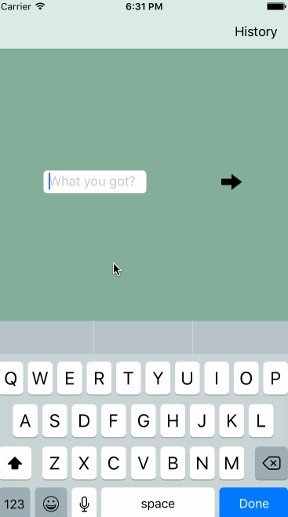

# SpotThePalindrome

**iOS app** - built in Obj-C

- [x] Home view presents user with a textbox and a button to start checking if the user's entered text is a palindrome
- [x] Textbox and button animates to jump up when keyboard covers them
- [x] Check button triggers a loading view and an alert, telling the user if the word is a palindrome
- [x] Features a History tab that saves all the previously entered word into Realm database
- [x] Previously entered words are presented on 2-column UICollectionView with a dismiss button to go back to previous screen
- [x] Autolayout is done programmatically

## Video Walkthrough

